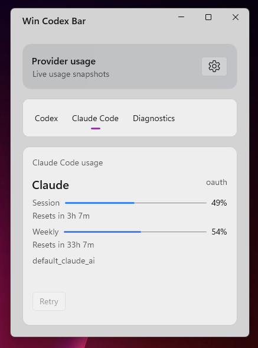

# Win Codex Bar

> [!NOTE]  
> Inspired by [CodexBar](https://github.com/steipete/CodexBar).

Win Codex Bar is a WinUI 3 desktop tray app for monitoring Codex and Claude Code usage. It shows usage windows, reset timelines, and diagnostics from OAuth, web-cookie, or CLI sources.

## Screenshot

<p align="center">
  
</p>

## Features

- Tray + window UI for Codex and Claude usage snapshots.
- Configurable source mode per provider: `Auto`, `OAuth`, `Web (Cookies)`, or `CLI`.
- Diagnostics timeline with provider filtering.
- Configurable refresh interval and per-provider enable/disable settings.

## Project Layout

- `WinCodexBar.UI/` WinUI 3 app (views, view models, services, manifests, assets).
- `WinCodexBar.Core/` shared models and provider fetch services.
- `WinCodexBar.Tests/` unit tests.

## Requirements

- Windows 10 1809+ (`10.0.17763.0` minimum).
- .NET 10 SDK.

## Build and Test

```powershell
dotnet restore WinCodexBar.UI/WinCodexBar.UI.csproj
dotnet build WinCodexBar.UI/WinCodexBar.UI.csproj -r win-x64
dotnet test WinCodexBar.Tests/WinCodexBar.Tests.csproj
```

## Run Locally

Open `WinCodexBar.UI/WinCodexBar.slnx` (or `WinCodexBar.UI/WinCodexBar.UI.csproj`) in Visual Studio and run the app.

## Provider Setup

### Codex

- OAuth auth is read from `%CODEX_HOME%\auth.json` (if `CODEX_HOME` is set), otherwise `%USERPROFILE%\.codex\auth.json`.
- `Auto` source tries `OAuth`, then `Web`, then `CLI`.
- `CLI` source requires the `codex` command on `PATH`.

### Claude Code

- OAuth auth is read from `%USERPROFILE%\.claude\.credentials.json`.
- `Auto` source tries `OAuth`, then `Web`, then `CLI`.
- `CLI` source requires the `claude` command on `PATH`.
